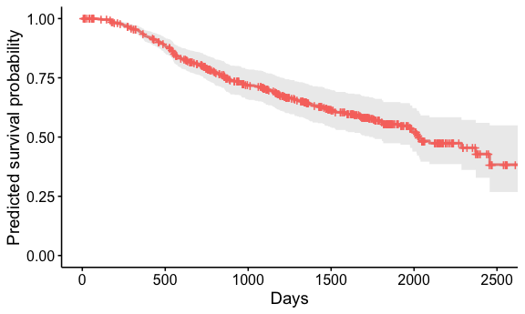

HW_5_DRAFT
================
Devon Park
2026-02-27

### Model Ouputs:

##### Notes on Data:

Based on the dataset, variable “hormone” equaled 1 for patients under
hormone therapy and 2 for patients not under hormone therapy. Those not
under hormone therapy were considered the reference group. Additionally,
variable “menopause” equaled 1 for participants who were experiencing
menopause and 2 for those who were not experiencing mnopause. The group
of participants who were not experiencing menopause were the reference
group for this variable.

##### Model 1

Model 1 is a Cox proportional hazards model including hormone therapy
group as the only covariate - **Covariate:** Hormone Therapy Group -
**Model form:**
$\lambda(t \mid hormone) = \lambda_0e^{\beta_1*hormone}$ - **Fitted
model ($\hat{\beta}$ rounded to three decimals):**
$\lambda(t \mid hormone) = \lambda_0e^{0.364*hormone}$

##### Model 1 output: exoponentiated coefficient

| Variable | Hazard Ratio | Std Error | Z statistic | p-value | Lower 95% CI | Upper 95% CI |
|:---|---:|---:|---:|---:|---:|---:|
| Hormone: Yes | 1.439 | 0.125 | 2.911 | 0.004 | 1.126 | 1.839 |

The corresponding hazard ratio for hormone therapy is
`exp(0.364) = 1.439`. These results suggest that patients in hormone
therapy have 1.439 times the hazard of recurrence compared to those not
under hormone therapy `(95%CI:1.126,1.839)`. That the 95% confidence
interval does not include the null value of 1 (no difference in hazard
between hormone therapy group and reference group) and that the
`p-value=0.004`, suggests there is statistically significant evidence at
$\alpha=0.05$ that hormone therapy is associated with an increased
hazard of recurrence.

##### Model 2

Model 2 extends Model 1 by adjusting for additional covariates. -
**Covariates:** Hormone therapy groups, Age, Menopause status, Tumor
size, and Number of nodes - **Model form:**
$\lambda(t\mid X) = \lambda_0e^{\beta_1*hormone + \beta_2*age + \beta_3*menopausal + \beta_4*size + \beta_5*nodes}$ -
**Fitted model ($\hat{\beta}$ rounded to three decimals):**
$\lambda(t \mid X) = \lambda_0e^{0.381*hormone -0.014*age -0.353*menopausal + 0.008*size + 0.052*nodes}$

##### Model 2 output: exoponentiated coefficients

| Variable | Hazard Ratio | Std Error | Z statistic | p-value | Lower 95% CI | Upper 95% CI |
|:---|---:|---:|---:|---:|---:|---:|
| Hormone: Yes | 1.464 | 0.128 | 2.970 | 0.003 | 1.138 | 1.882 |
| Age (years) | 0.987 | 0.009 | -1.506 | 0.132 | 0.969 | 1.004 |
| Menopausal: Yes | 0.702 | 0.179 | -1.977 | 0.048 | 0.495 | 0.997 |
| Tumor size (mm) | 1.008 | 0.004 | 2.013 | 0.044 | 1.000 | 1.016 |
| Nodes involved | 1.053 | 0.007 | 7.109 | 0.000 | 1.038 | 1.069 |

After adjustment for age, menopausal status, tumor size, and number of
involved lymph nodes, the hazard ratio for hormone therapy is
`exp(0.381) = 1.464 (95% CI: 1.138–1.882, p-value = 0.003)`. That the
hazard ratio for hormone therapy remains similar between Model 1
`(HR = 1.439)` and Model 2 `(HR = 1.464)` suggests that the added
covariates (age, menopausal status, tumor size, and number of involved
nodes) do not substantially confound the association between hormone
therapy and recurrence. However, the number of nodes (variable = nodes)
appears to have the greatest association to hazard of occurence.For
every additional node the hazard increases by
`5.3% (HR: 1.053, p-value<<0.05` after adjusting for the other
covariates.

##### Model 3

Model 3 further extends Model 2 by including an interaction term between
hormone therapy and number of nodes - **Covariates:** Hormone therapy
groups, Age, Menopause status, Tumor size, Number of nodes, and the
Interaction between hormone therapy groups and number of nodes - **Model
form:**
$\lambda(t\mid X) = \lambda_0e^{\beta_1*hormone + \beta_2*age + \beta_3*menopausal + \beta_4*size + \beta_5*nodes + \beta_6*nodes*hormone}$ -
**Fitted model ($\hat{\beta}$ rounded to three decimals):**
$\lambda(t\mid X) = \lambda_0e^{0.630*hormone  -0.015*age  -0.393*menopausal + 0.007*size + 0.083*nodes -0.038*nodes*hormone}$

##### Model 3 output: exoponentiated coefficients

| Variable | Hazard Ratio | Std Error | Z statistic | p-value | Lower 95% CI | Upper 95% CI |
|:---|---:|---:|---:|---:|---:|---:|
| Hormone: Yes | 1.878 | 0.167 | 3.766 | 0.000 | 1.353 | 2.607 |
| Nodes involved | 1.086 | 0.014 | 5.991 | 0.000 | 1.057 | 1.116 |
| Age (years) | 0.985 | 0.009 | -1.674 | 0.094 | 0.968 | 1.003 |
| Menopausal: Yes | 0.675 | 0.179 | -2.195 | 0.028 | 0.475 | 0.959 |
| Tumor size (mm) | 1.007 | 0.004 | 1.666 | 0.096 | 0.999 | 1.014 |
| Hormone: Yes × nodes | 0.963 | 0.015 | -2.480 | 0.013 | 0.934 | 0.992 |

Model 3 extends Model 2 by including an interaction between hormone
therapy and number of involved lymph nodes. The main effect of hormone
therapy `(HR = 1.878, 95% CI: 1.353-2.607, p = 0.000)` is the hazard
ratio when `nodes = 0`. The interaction term is statistically
significant `(HR = 0.963, 95% CI: 0.934–0.992, p = 0.013)` at
$\alpha = 0.05$. This suggests that the effect of hormone therapy on
recurrence depends on the number of nodes involved.

The interaction hazard ratio of `0.963` suggests that for each
additional involved node, the hazard ratio for hormone therapy decreases
by approximately 3.7%. In other words, the effect of hormone therapy on
the hazard of recurrence becomes smaller as the number of nodes
increases.

# HW 5

In Homewrok 4, we fit Cox proportional hazards regression models to :
study risk factors for the breast cancer recurrence with the
hwdata1.csv: Model 1 with the hormone therapy group as the only
covariate; Model 2 with hormone therapy groups, age, menopause status,
tumor size, and number of nodes as covariates; Model 3 with hormone
therapy groups, age, menopause status, tumor size, number of nodes, and
the interaction between hormone therapy groups and number of nodes as
covariates.

## QUESTION 1:

Compare Model 1 and Model 2. State the null and alternative hypothesis,
test statistic (state which test was used), p-value, degrees of freedom,
and conclusion.

Compare Model 1 and Model 2. State the null and alternative hypothesis,
test statistic (state which test was used), p-value, degrees of freedom,
and conclusion.

- Null Hypothesis:
  $H_0 : \beta_age = \beta_menopausal = \beta_size = \beta_nodes = 0$

- Alternative Hypothesis: $H_A : \text{At least one } \beta \neq 0$

- Test Statistic: $G \sim \chi^2_{m2-m1}$

- Test: Partial likelihood ratio test:
  $G=2[l_{m2}(\hat\beta)-l_{m1}(\hat\beta)]$

  - It is partial becuase Cox model is semiparametric

- Define alpha: $\alpha = 0.05$

- Degrees of Freedom: $4$

  - It is the number of different groups between the models

|  |
|:---|
| \##### NOTES |
| – Variable selection is commonly done by comparing models using the partial likelihood ratio test: $G=2[l_{m2}(\hat\beta)-l_{m1}(\hat\beta)]$ |
| \- G is small if large model (one with more betas) doesn’t imporve fit by a lot - G is large if the larger model improves the fit by a lot |
| Null Hypothesis: |
| Under the null Hypothesis, $G \sim \chi^2_{q-p}$ where all the extra parameters in the larger model are actually zero (so model 2 is not better than model 1). If p value is small we reject the null. |
| The chi-square distribution tells us how much improvement is “normal” under pure noise.” |
| Under the null hypothesis, the likelihood ratio test statistic follows a chi-square distribution with degrees of freedom equal to the number of additional parameters being tested. |

Full Model Output

| Model   | Log Likelihood | LRT Test Statistic (G) |  Df | p-value |
|:--------|---------------:|-----------------------:|----:|--------:|
| Model 1 |      -1783.694 |                     NA |  NA |      NA |
| Model 2 |      -1755.155 |                57.0778 |   4 |       0 |

| LRT Test Statistic (G) | Degrees of Freedom | p-value |
|-----------------------:|-------------------:|--------:|
|                57.0778 |                  4 |       0 |

Conclusion: Based on the partial likelihood ratio test, at a predefined
$\alpha = 0.05$ we get $G = 57.0778 \sim \chi^2_4$ with a \`p \< 0.001’
(R rounds to 0). As p \< 0.05, we reject the null hypothesis that age,
menopausal status, tumor size, and number of involved nodes all together
have no effect on the hazard of recurrence
($H_0 : \beta_age = \beta_menopausal = \beta_size = \beta_nodes = 0$).
Further more, these results suggest that Model 2 provides a
significantly better fit than Model 1: the additional covariates
collectively improve the model.

## QUESTION 2:

Compare Model 2 and Model 3. State the null and alternative hypothesis,
test statistic (state which test was used), p-value, degrees of freedom,
and conclusion.

##### Null Hypothesis:

$H_0 : \beta_{nodes*hormone} = 0$

##### Alternative Hypothesis:

$H_A : \beta_{nodes*hormone} \neq 0$

- Null Hypothesis: $H_0 : \beta_{nodes*hormone} = 0$

- Alternative Hypothesis: $H_A : \beta_{nodes*hormone} \neq 0$

- Test Statistic: $G \sim \chi^2_{m3-m2}$

- Test: Partial likelihood ratio test:
  $G=2[l_{m3}(\hat\beta)-l_{m2}(\hat\beta)]$

  - It is partial becuase Cox model is semiparametric

- Define alpha: $\alpha = 0.05$

- Degrees of Freedom: $1$

  - It is the number of different groups between the models

| Model   | Log Likelihood | LRT Test Statistic (G) |  Df | p-value |
|:--------|---------------:|-----------------------:|----:|--------:|
| Model 2 |      -1755.155 |                     NA |  NA |      NA |
| Model 3 |      -1752.312 |                 5.6862 |   1 |  0.0171 |

Full Model Output

| LRT Test Statistic (G) | Degrees of Freedom | p-value |
|-----------------------:|-------------------:|--------:|
|                  5.686 |                  1 |   0.017 |

**Conclusion:** Based on the partial likelihood ratio test, at a
predefined $\alpha = 0.05$ we get $G = 5.686 \sim \chi^2_1$ with
`p = 0.0.017`. As p \< 0.05, we reject the null hypothesis that the
number of involved nodes does not impact the effect the of hormone
therpay on the hazard of reccurrence
($H_0 : \beta_{nodes*hormone} = 0$). Further more, these results suggest
that Model 3 provides a significantly better fit than Model 2: the
addition of the interaction term improves model fit.

## QUESTION 3:

Based on Model 3, draw the survival curve for a patient under hormone
therapy, at age 53, being menopausal, having tumor of size 25mm, and
having 3 nodes involved. What is the probability that this patient
survives more than three years (1095 days)? Provide code and relevant
output.

General Model:
$\lambda(t\mid X) = \lambda_0e^{\beta_1*hormone + \beta_2*age + \beta_3*menopausal + \beta_4*size + \beta_5*nodes + \beta_6*nodes*hormone}$

AKA: get the survival function $S(t\mid X)$ (The survival probability
over time for one specific patient or $P(T>t \mid X))$ for someone with
the following characteristics: - hormone_grp = yes - age = 53 -
menopausal = yes - (tumor) size = 25 mm - (number of) nudes = 3

Create a row of data (a new dataframe of 1 row) with this patient’s
characteristics.

Plug into survfit: - cox estimates the coefficients (betas), and the
survival function in a cox model is as follows:
$S(t\mid X) = S_0(t)^{exp(\beta X)}$ - To compute survival at every time
point, we need to get an estimated basline survival $S_0(t)$ and
$\beta X$

|  |
|----|
| How does survfit() work?? calculates $\beta X$ for all of the covariates we plug in. $exp(\beta X)$ is a risk multiplier :” what is the patient’s hazard relative to baseline?” |
| If $exp(\beta X)$ = 1 → same as baseline If $exp(\beta X)$ \> 1 → higher risk If $exp(\beta X)$ \< 1 → lower risk |
| NOTE: what is the object sf_new?? |
| It is the survival probabilities at every observed event time, along with their related standard errors and CIs. sf_new is a function over time. |
| About the data: `n = 686` : total sample size used to fit model 3 –\> comes from original dataset `events = 299` :number of recurrence events in the original dataset used to estimate model 3. |
| `median = 2030` (aka the median survival time: time when survival probability drops to 0.5. in this case, the estimated median survival time for this specific patient is 2030 days.) SO, S(2030\|X) = 0.5 and in words, this patient has a 50% probability of surviving beyond 2030 days. |
| `0.95LCL = 1730`: lower 95% CI for median survival time.(we are 95% confident the true median survival is at least 1730 days) |
| `0.95UCL = NA` upper 95% CI –\> The upper confidence limit for the median survival cannot be estimated! (The data do not allow us to estimate an upper 95% bound for the median survival.) |
| \##### plot the survival curve  |
| What is the probability that this patient survives more than three years (1095 days)? |
| In other words…. $P(T>1095\mid X) = S(1095 \mid X)$ |
| How to solve? |
| Table: Predicted 3-Year Survival Probability (Model 3) |
| \| Time\| Survival Probability\| Std. Error\| Lower 95% CI\| Upper 95% CI\| \|—-:\|——————–:\|———-:\|————:\|————:\| \| 1095\| 0.705\| 0.034\| 0.642\| 0.774\| |
| Interpreting output: $S(1095 \mid X) = 0.705$: The estimated probability that this patient survives more than 1095 days (3 years) is 70.5%. |
| `lower 95% CI: 0.642 Upper 95% CI 0.774` We are 95% confident that the true probability this patient survives more than 3 years lies between 64.2% and 77.4%. |
| `n.risk = 333:` number of patients that were still in study (under observation) by t=1095 |
| `n.event = 224:` total number of events that had occured by the time we had reached t=224 |

DRAFT FROM FINAL SPACE
